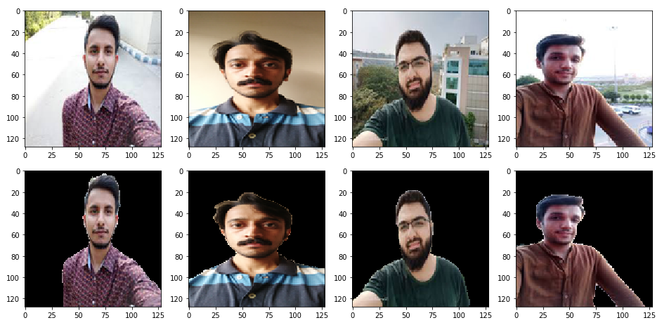
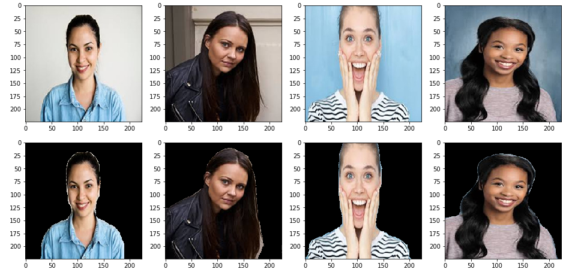
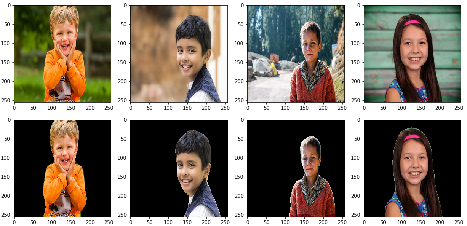
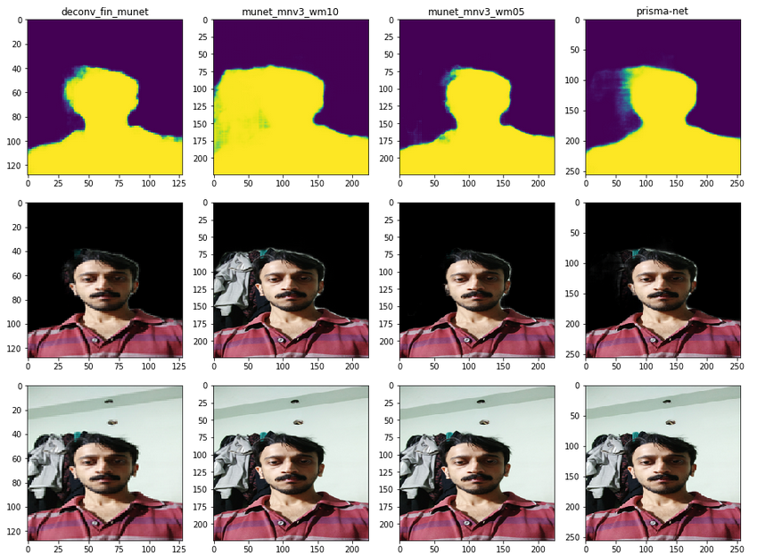
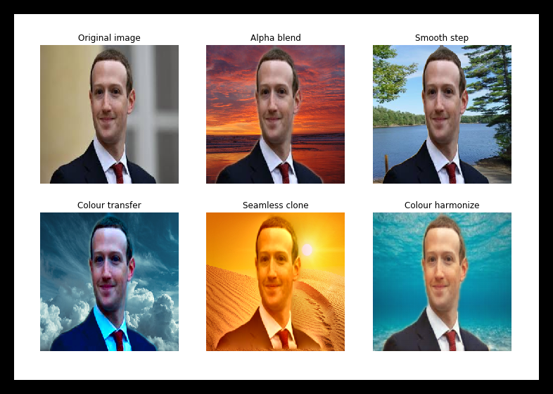

# Fast Person Portrait Segmentation

**Portrait segmentation** is segmenting a person in an image from the background. This is modeled as a **semantic segmentation** task to predict the label of every pixel (dense prediction) in an image.

Here we limit the prediction to **binary classes** (person or background) and use only plain **portrait-selfie** images for matting. Experimentations with the following architectures for implementing a real-time portrait segmentation are discussed below:

1.  Mobile-Unet
2.  Prisma-Net
3.  Portrait-Net
4.  Slim-Net

The models were trained with standard(& custom) **portrait datasets** and their performance was compared using standard evaluation metrics and benchmarking tools. Finally, the models were deployed on **edge devices**, using popular embedded(mobile) machine-learning platforms for **real-time inference**.

_Note: This is a copy of the [Portrait Segmentation repo](https://github.com/anilsathyan7/Portrait-Segmentation) by Anil Sathyan_

## Main Dependencies

-   tensorflow(==1.14.0)
-   keras(>=2.2.4)
-   opencv(>=3.4)

_Note: conda_install.sh will install all the required dependencies_

## Prerequisites

-   Download base training [data](https://drive.google.com/file/d/1UBLzvcqvt_fin9Y-48I_-lWQYfYpt_6J/view?usp=sharing)
-   Download caffe harmonization [model](https://drive.google.com/file/d/1bWafRdYBupr8eEuxSclIQpF7DaC_2MEY/view?usp=sharing)
-   Download portrait dataset [AISegment](https://datasetsearch.research.google.com/search?query=portrait%20segmentation&docid=O3kWsG%2FOg%2FZspufiAAAAAA%3D%3D) (Optional)

## Pre-trained Weights

Pretrained `graphe-def`, `hdf5`, `onnx`, `pth`, and `tflite` models can be downloaded from this [Google Drive Link](https://drive.google.com/file/d/1wHmttTd073J3ccug1PfpsAnnmHaiEt_x/view?usp=sharing)

## Datasets

The base training data consists of **18698 human portrait RGB images of size 128x128**, along with their **masks(ALPHA)**. Here we augment the [**PFCN**](https://1drv.ms/u/s!ApwdOxIIFBH19Ts5EuFd9gVJrKTo) dataset with (handpicked) portrait images from **supervisely** dataset. Additionally, we download **random selfie** images from web and generate their masks using the state-of-the-art **deeplab-xception** semantic segmentation model.

We then perform augmentations like **cropping, brightness alteration, flipping, curve filters, motion blur etc.** to increase dataset size and model robustness. Since most of our images contain plain background, we create new **synthetic images** using random backgrounds (natural) using the default dataset.

Besides the above augmentations, we **normalize & standardize** the images and perform **run-time augmentations like flip, shift and zoom** using Keras data generator and preprocessing module.

**AISegment**: It is a human matting dataset for **binary segmentation** of humans and the background. It is currently the largest portrait matting dataset, with **34,427 images** and corresponding mattes. The data set was marked by the Beijing Play Star Convergence Technology Co. Ltd., and the portrait soft segmentation model trained using this data has also been **commercialized**.

**Dataset Links**

1.  [Portseg_128](https://drive.google.com/file/d/1UBLzvcqvt_fin9Y-48I_-lWQYfYpt_6J/view)
2.  [Portrait_256](https://drive.google.com/file/d/1FQHaMrsFyxUv5AtwjfPD0gtmEVFM7w3X/view?usp=sharing)
3.  [PFCN](https://1drv.ms/u/s!ApwdOxIIFBH19Ts5EuFd9gVJrKTo)
4.  [AISegment](https://datasetsearch.research.google.com/search?query=portrait%20segmentation&docid=O3kWsG%2FOg%2FZspufiAAAAAA%3D%3D)
5.  [Baidu_Aug](https://drive.google.com/file/d/1zkh7gAhWwoX1nR5GzTzBziG8tgTKtr73/view?usp=sharing)
6.  [Supervisely](https://supervise.ly/explore/projects/supervisely-person-dataset-23304/datasets)
7.  [Pascal_Person](https://github.com/PINTO0309/TensorflowLite-UNet/tree/master/data_set/VOCdevkit/person)
8.  [Supervisely Portrait](https://www.dropbox.com/s/bv8r5vmjc52a8s6/supervisely_portrait.zip)
9.  [UCF Selfie](https://www.crcv.ucf.edu/data/Selfie)

### Annotation Tools

A [good dataset](https://hackernoon.com/stop-feeding-garbage-to-your-model-the-6-biggest-mistakes-with-datasets-and-how-to-avoid-them-3cb7532ad3b7) is always the first step for coming up with a robust and and accurate model, especially for semantic segmentation. There are many datasets available for portrait(person) segmentation like **PFCN, MSCOCO Person, PascalVOV Person, Supervisely** etc. But it seems that either the **quality or quantity** of the images are still insufficient for our use case. So, it would be a good idea to **collect custom images** for our training process. It takes a lot of time and effort for semantic segmentation annotation as compared to classification or detection.

Useful tools for **data annotation and collection**:

1.  **Offline Image Editors** - Pros: Free, High Accuracy; Cons: Manual Annotation Time; Eg: **GIMP, Photoshop** etc.
2.  **Offline Image Annotation Tools** - Pros: Free, Good Accuracy; Cons: Manual Annotation Time; Eg: **cvat**, etc.
3.  **Pretrained Models**: Pros - Fast, Easy to Use; Cons: Limited Accuracy; Eg: **Deeplab Xception, MaskRCNN** etc.
4.  **Online Annotation Tools** - Pros: Automated, Easy to Use, Flexible; Cons: Price; Eg: **Supervisely, Remove.bg**.
5.  **Crowd Sourcing Tools** - Pros: Potential Size and Variety, Less Effort; Cons: Cost, Time, Quality; Eg: **Amazon MTurk, Freelancers**.

To use the model in mobile phones, it is important to include lots of **portrait images captured using mobile phones** in the dataset.

## How to run

### Set up a conda virtual environment and run the following:

`$ bash conda_install.sh`

Download the **dataset** from the link above and put them in **data** folder. Then run the scripts in the **following order**:

```python
$   python train.py # Train the model on data-set
$   python eval.py checkpoints/<CHECKPOINT_PATH.hdf5> # Evaluate the model on test-set
$   python export.py checkpoints/<CHECKPOINT_PATH.hdf5> # Export the model for deployment
$   python test.py <TEST_IMAGE_PATH.jpg> # Test the model on a single image
$   ./run_inference.sh inference/inference_minimal.py -b media/img/beach.jpg # Run the model on webcam replacing bg with media/img/beach.jpg
$   ./run_inference.sh inference/inference_openvino.py                # 35 FPS, Run the model using openvino inference engine
$   ./run_inference.sh inference/inference_tensorflow_pb.py           # 24 FPS, run model with tensorflow v1 frozen graph inference
$   ./run_inference.sh inference/inference_nosmoothed_with_slider.py  # 19 FPS, run model with hdf5 inference & sliders for changing frame skip, smoothing
$   ./run_inference.sh inference/inference_smoothed_with_slider.py    # 19 FPS, run model with hdf5 inference & sliders for changing frame skip, smoothing
$   ./run_inference.sh inference/inference_tflite.py                  # 11 FPS, Run the model using tflite interpreter
$   ./run_inference.sh inference/inference_portrait_video_tflite.py   #  8 FPS, Use portrait-net for video segmentation
$   ./run_inference.sh inference/inference_seg_video.py               # Apply blending filters on video
```

## Mobile-Unet Architecture

Here we use **Mobilenet v2** with **depth multiplier 0.5** as encoder (feature extractor).

For the **decoder part**, we have two variants. A upsampling block with either  **Transpose Convolution** or **Upsample2D+Convolution**. The former has a **stride of 2**, whereas the later uses **resize bilinear** for upsampling, along with Conv2d. Encoder and decoder section must have proper **skip connections** for better results. Additionally, we use **dropout** regularization to prevent **overfitting**.It also helps our network to learn more **robust** features during training.

## Training graphs

Since we are using a **pretrained mobilenetv2** as encoder for a head start, the training **quickly converges to 90% accuracy** within first couple of epochs. Also, we use a flexible **learning rate schedule** (ReduceLROnPlateau) for training the model.

### Result

#### 1. Model Type - 1

Here the **inputs and outputs** are images of size **128x128**.The backbone is **mobilenetv2** with **depth multiplier 0.5**.
The **first row** represents the **input** and the **second row** shows the corresponding **cropped image** obtained by cropping the input image with the **mask output** of the model.



**Accuracy: 96%**,
**FPS: 10-15**

#### 2. Model Type - 2

Here the **inputs and outputs** are images of size **224x224**. The backbone is **mobilenetv3** with **depth multiplier 1.0**.
The **first row** represents the **input** and the **second row** shows the corresponding **cropped image** obtained by cropping the input image with the **mask output** of the model.



**Accuracy: 97%**,
**FPS: 10-15**

#### 3. Model Type - 3

Here the **inputs and outputs** are images of size **256x256**. The prisma-net architecture is based on **unet** and uses residual blocks with **depthwise separable convolutions** instead of regular convolutional blocks(Conv+BN+Relu). Also,it uses **elementwise addition** instead of feature concatenation in the decoder part.  

The **first row** represents the **input** and the **second row** shows the corresponding **cropped image** obtained by cropping the input image with the **mask output** of the model.



**Accuracy: 96%**,
**FPS: 8-10**

**Note:** Accuracy measured on a predefined test data-set and FPS on android application in a OnePlus3 device

### Failure cases



When there are objects like **clothes, bags** etc. in the background the model fails to segment them properly as background, especially if they seem connected to the foreground person. Also if there are **variations in lighting** or illumination within the image, there seems to be a **flickering** effect on the video resulting in holes in the foreground object.

#### Quantizing MobilenetV3 Models With Keras API

**MobileNetV3** is the next generation of on-device deep vision model from Google. It is twice as fast as MobileNetV2 with equivalent accuracy, and advances the state-of-the-art for mobile computer vision networks. Here we use small version of **mobilenetv3** with input size 256 as the encoder part of the network. In the **decoder** module we use **transition blocks** along with upsampling layers, similar to the decoder modules in the portrait-net architecture. There are two branches in this block: one branch contains two **depthwise separable convolutions** and the other contains a single **1×1 convolution** to adjust the number of channels. For upsampling we use **bilinear resize** along with the transition blocks in the decoder module. In the case of **skip connections** between encoder and decoder, we use **element-wise addition** instead of concatenation for faster inference speed.

During training, initially we **freeze** all the layers of encoder and train it for 10 epochs. After that, we unfreeze all the layers and train the model for additional 10 epochs. Finally, we perform **quantization aware training** on the float model, and convert all of the the models to **tflite** format.

**Observations:-**

1.  Using the pretrained mobilenetv3 as the encoder during training greatly improved the **convergence speed**. Also, the input images were normalized to [-1.0, 1.0] range before passing to the model. The float model converged to **98% validation accuracy** in the first 20 epochs.
2.  Using the latest Tensorflow built from source and AiSegment dataset with 68852 images, the training process took about **2 hours** for **20 epochs**, on a Tesla P100 GPU in Google Colaboratory.
3.  In the current Tensorflow 2.3 and tf model optimization library, some layers like **Rescale, Upsampling2D, Conv2DTranspose** are not supported by the tf.keras Quantization Aware Training API's. For this purpose you have to install the latest **nightly version** or build the same from source. Similarly the mobilenetv3 pretrained models are only available in tf-nightly(currently).
4.  Using **elementwise additon** instead of concatenation on skip connection bewteen encoder and decoder greatly helped us to decrease the model size and improve it's **inference** time.
5.  After quantization aware training, even though the model **size was reduced by 3x**, there was **no considerable loss in model accuracy**.
6.  On **POCO X3** android phone, the float model takes around **17ms on CPU and 9ms on it's GPU** (>100 FPS), whereas the quantized model takes around 15ms on CPU (2 threads). We were unable to run the fully quantized models(UINT8) using nnapi or hexagon delegate since some of the layers were not fully supported. However we can run them partially on such accelerators with decreased performance(comparatively).

### Model running time

Summary of model size and running time in android:

| Model Name                    | CPU Time (ms) | GPU Time (ms) | Parameters (M) | Size (MB) | Input Shape |
| ----------------------------- | ------------- | ------------- | -------------- | --------- | ----------- |
| **deconv_fin_munet.tflite**   | 165           | 54            | 3.624          | 14.5      | 128         |
| **bilinear_fin_munet.tflite** | 542           | 115           | 3.620          | 14.5      | 128         |
| **munet_mnv3_wm10.tflite**    | 167           | 59.5          | 2.552          | 10.2      | 224         |
| **munet_mnv3_wm05.tflite**    | 75            | 30            | 1.192          | 4.8       | 224         |
| **prisma-net.tflite**         | 426           | 107           | 0.923          | 3.7       | 256         |

The parameter 'wm' refers to the **width multiplier** (similar to depth multiplier). We can configure the **number of filters** of particular layers and adjust the **speed-accuracy tradeoffs** of the network using this parameter.

### Portrait Filters (Python)

We can add filters to <b>harmonize</b> our output image with the background. Our aim is to give a <b>natural blended feel</b> to the output image i.e the <b>edges</b> should look smooth and the <b>lighting</b>(color) of foreground should match(or blend) with its background.

The first method is <b>alpha blending</b>, where the foreground images are blended with background using the blurred(gaussian) version of the mask.In the <b>smooth-step</b> filter, we clamp the blurred edges and apply a polynomial function to make the foreground image edges smoother. Next, we use the <b>color transfer</b> algorithm to transfer the global color to the foreground image. Also, OpenCV provides a function called <b>seamless clone</b> to blend an image onto a new background using an alpha mask. Finally, we use the OpenCV DNN module to load a </b>color harmonization</b> model(deep model) in <b>caffe</b> and transfer the background style to the foreground.

Sample results:



For **live action**, checkout the script **seg_video.py** to see the effects applied on a **webcam video**.

Also download the **caffe model** and put it inside **models/caffe** folder.

#### Keyboard Controls:

Hold **down** the following keys for **filter** selection.

-   **C**- Color transfer
-   **S**- Seamless clone
-   **M**- Smooth step
-   **H**- Color harmonize

Move the **slider** to change the background image.

### Tensorflowjs: Running the model on a browser

To ensure that the application runs in a <b>platform independent</b> way(portable), the simplest way is to implement them as a <b>web-application</b> and run it on a <b>browser</b>. One can easily convert the trained model to tfjs format and run them in javascript using Tensorflowjs conversion tools. If one is familiar with <b>React/Vue</b>js, one can easily incorporate the tfjs into the application.

This is a sample link to a portrait segmentation **webapp**: [CVTRICKS](https://mycvtricks.000webhostapp.com)

If you want to run it **locally**, start a local server using python **SimpleHTTPServer**. Initially configure the **hostname, port and CORS permissions** and then run it on your browser. Although, the application will be **computationally intensive** and resource heavy.

### OpenVINO: Deploying deep vision models at the edge for Intel devices

Intel's openVINO toolkit allows us to **convert and optimize** deep neural network models trained in popular frameworks like **Tensorflow, Caffe, ONNX** etc. on **Intel CPU's, GPU's and Vision Accelerators(VPU)**, for efficient inferencing at the edge.
Here, we will convert and optimize a pre-trained deeplab model in Tensorflow using OpenVINO toolkit, for **person segmentation**.
As an additional step, we will see how we can **send the output video to an external server** using ffmpeg library and pipes.

1.  Download and install [openvino toolkit](https://docs.openvinotoolkit.org/latest/index.html).
2.  Download the Tensorflow [deeplabv3_pascal_voc_model](http://download.tensorflow.org/models/deeplabv3_mnv2_pascal_trainval_2018_01_29.tar.gz), for semantic segmentation.
3.  Download and install [ant-media server](https://github.com/ant-media/Ant-Media-Server/wiki/Getting-Started).

Once you install and configure the openVINO inference engine and model optimizer, you can directly **convert the Tensorflow deeplab model** with a single command:

    python3 /opt/intel/openvino/deployment_tools/model_optimizer/mo.py --input_model frozen_inference_graph.pb --output SemanticPredictions --input ImageTensor --input_shape "(1,513,513,3)"

### Segmentation via Background Subtraction: A Naive Approach

If we have a **static background**, we can easily obtain the mask of new objects appearing on the scene using the methods of background subtraction. Even though this seems straight-forward; there seems to be couple of **challenges** in this scenario. Firstly, even if objects does not move in the background, there will be small variations in corresponding pixel values due to changes in **lighting**, noise, camera quality etc. Secondly, if the new objects have **color** similar to that of the background, it becomes difficult to find the **image difference**.

Here is a simple **algorithm** for segmentation, using background subtraction. We assume that the background image or camera is  **static** during the entire experiment.

1.  Capture the first 'N' background images and find the mean background image.
2.  Convert the background image to grayscale and apply gaussian blur.
3.  Capture the next frame in grayscale, with new objects and apply gaussian blur.
4.  Find the absolute difference between current frame and background image.
5.  Threshold the difference with a value 'T' and create the binary difference-mask.
6.  Apply morphological operations to fill up the holes in the mask.
7.  Find the largest contour and remove the smaller blobs in the mask.
8.  Apply alpha blend on the frame with any background image, using the mask.
9.  Display the output on screen.
10. Repeat steps 3 to 9, until a keyboard interruption.

The algorithm works pretty well, if there is **proper lighting and clear color difference** between the foreground object and background. Another idea is to detect the face and exclude potential background regions based on some heuristics. Other classical methods include **grabcut, active contours**, feature based(**HOG**) detectors etc. But none of them seems to be **robust, real-time and light-weight** like our deep neural network models. Additionally, using trimap-masks and [depth sensors(ToF)](https://community.arm.com/developer/tools-software/graphics/b/blog/posts/the-rise-of-depth-on-mobile) on phone could help us achieve better visual perception and accuracy on the mobile application eg. [uDepth](https://ai.googleblog.com/2020/04/udepth-real-time-3d-depth-sensing-on.html).

Also check-out this cool application: [Virtual Stage Camera](https://www.roland.com/global/products/virtual_stage_camera/)

### Techniques For Improving Robustness, Accuracy and Speed

Here are some **advanced** techniques to improve the **accuracy, speed and robustness** of the portrait segmentation model for **videos**. Most of them are inspired from the following two papers:-

1.  **PortraitNet: Real-time portrait segmentation network for mobile device**
2.  **Real-time Hair Segmentation and Recoloring on Mobile GPUs**

**Boundary Loss**: In order to improve the boundary accuracy and sharpness, we modify the last layer in the decoder module by adding a new convolution layer in parallel to generate a **boundary detection map**. We generate the boundary ground truth from manual labeled mask using traditional edge detection algorithm like **canny** or sobel, on-the-fly. Also, we need to use **focal loss** instead of BCE, for training the network with boundary masks. Finally, we can remove this additional convolution layer for edges and export the model for inference.

**Consistency Constraint Loss**: A novel method to generate soft labels using the tiny network itself with data augmentation, where we use **KL divergence** between the heatmap outputs of the original image and texture enhanced image, for training the model. It further improves the accuracy and **robustness** of the model under various **lighting** conditions.

**Refined Decoder Module**: The decoder module consists of refined residual block with **depthwise convolution** and up-sampling blocks with transpose convolution. Even though  it includes the skip connections similar to unet architecture, they are **added** to the layers in decoder module channel-wise instead of usual concatenation. Overall, this improves the execution **speed** of the model.

**Temporal Consistency**: A video model should exhibit **temporal redundancy** across adjacent frames. Since the neighboring frames are similar, their corresponding segmentation masks should also be similar(ideally). Current methods that utilize LSTM, GRU(Deep) or Optical flow(Classic) to realize this are too computationally expensive for real-time applications on mobile phones. So, to leverage this temporal redundancy, we append the segmentation output of the **previous frame** as the **fourth channel(prior)** of the current input frame during inference. During training, we can apply techniques like **affine transformations, thin plate spline smoothing, motion blur** etc. on the annotated ground truth to use it as a previous-mask. Also, to make sure that the model robustly handles all the use cases, we must also train it using an **empty previous mask**.

**High resolution Input**: In our original pipeline, we **downsample** our full resolution image from mobile camera to a lower  resolution(say 128 or 224) and finally after inference, we  upsample the output mask to full resolution. Even though output results are satisfactory; there are couple of problems with this approach. Firstly, the resized mask **edges** will be coarse(stair-case) or **rough** and extra **post-processing** steps will be needed to smoothen the mask. Secondly, we loose lots of **details** in the input due to downsampling and thus it affects the output mask quality. If we use a larger input size, it would obviously increase the computation time of the model. The primary reason for this increase, is the increase in number of parameters. Also, on a mobile device the CPU-GPU data transfer takes considerable amount of time, especially when the inputs are large. To solve the latter problem, we can use techniques like **SSBO**(low level) or frameworks like **mediapipe**(high-level) which already comes with a optimized inference pipeline. As for the former one, we can slightly modify the architecture of the model such that, for most part **convolutions** happen at a **lower spatial dimension**. The idea is to rapidly downsample the input at the beginning of the  network and work with a smaller resolution image throughout a **deeper** version of the network . Finally, **upsample** the result from the final layers to full scale, **within-the model**. Thus, it ensures that the model **learns the upsampling or downsampling** itself and eliminates the need for a separate post-inference resize or smoothing.

**Advanced Activation Function**: Newer activation  functions like **Swish**(mobilenetv3) or **PRelu**(mediapipe hair segmentation) seems to give better **accuracy** with lower execution time. However, we may need to restructure our network and implement **custom-layers**  for such operators to properly run on mobile **GPU**, using Tensorflow-lite.


The portrait-net model for **videos** was successfully trained using **pytorch** and exported to **tflite** format. The new dataset consist of **60,000** images for training and **8852** images for testing.It includes portrait images from **AISegment** dataset and **synthetic images** with custom backgrounds. This model with **input size of 256x256** took about **5 days** for training on a **GTX 1080 Ti** with batch size of **48**. Finally, an **mIOU of 98%** was obtained on the test-set after **500 epochs**, using a minimal learning rate of **1e^-6**(after decay). The new portrait dataset, conversion scripts, **trained models** and corresponding inference code in python are also available in the respective folders. It can be easily used with the current **android application**(SegMeV2) by slightly modifying the **I/O** handling steps. A frame rate of **30 FPS** was achieved using this model.

### Post-Training Quantization

**Quantizing** deep neural networks uses techniques that allow for **reduced precision** representations of weights and, optionally, activations for both storage and computation(for eg. UINT8 or FLOAT16). It can **reduce model size** while also improving CPU and hardware accelerator **latency**, with little **degradation in model accuracy**. Tensorflow lite supports two types of quantization viz. **quantization aware training and post training quantization**. Even though the former method produces better accuracy, it is only  **supported** by a few subset of convolutional neural network architectures. Also, currently Tensorflow 2.0 and Keras does not support this technique. Therefore, we are left with only one option i.e Post-training quantization.

Again, there are two types of post-training quantization: **weight quantization and full integer quantization**(float also). In the weight quantization, only the weights are converted to **8 bit integer** format. At inference, weights are converted from 8-bits of precision to floating point and computed using **floating-point kernels**. In full integer quantization, we use integer weights and **integer computations** on the model layers. For this purpose, you need to measure the dynamic range of activations and inputs by supplying a **representative data set**, during the conversion process. The potential advantages include **faster inference, reduced memory usage** and access to hardware accelerators like TPU, NPU etc. On the flip side, it can lead to **accuracy degradation**, especially in scenarios where high **pixel accuracies** or precise boundaries are desired.

The **portrait-net and prisma-net** models were successfully converted to quantized format. Their **size** was reduced by about **3x** and their outputs were verified using a test dataset. We were able to convert the prisma-net model to TPU format; but unfortunately the portrait-net model failed in the conversion process(layer compatibility issue). The edge TPU model took only a mere **12.2 ms** for inference, in comparison to the inference on CPU, which took about **4357.0ms** with quantized model and **500ms** with float model. The **CPU**(i7-3632QM CPU @ 2.20GHz) might mostly be using a **single core** for inference. But even if we include other possible overheads, this **40x speed-up** seems to be worth the effort. Besides, it consumes **20 times less power** than CPU.

## Acknowledgments

-   [Repo forked from Anil Sathyan](https://github.com/anilsathyan7/Portrait-Segmentation)
-   <https://www.tensorflow.org/model_optimization>
-   <https://www.tensorflow.org/lite/performance/gpu_advanced>
-   <https://github.com/cainxx/image-segmenter-ios>
-   <https://github.com/gallifilo/final-year-project>
-   <https://github.com/dong-x16/PortraitNet>
-   <https://github.com/ZHKKKe/MODNet>
-   <https://github.com/clovaai/ext_portrait_segmentation>
-   <https://github.com/tantara/JejuNet>
-   <https://github.com/lizhengwei1992/mobile_phone_human_matting>
-   <https://github.com/dailystudio/ml/tree/master/deeplab>
-   <https://github.com/PINTO0309/TensorflowLite-UNet>
-   <https://github.com/xiaochus/MobileNetV3>
-   <https://github.com/yulu/GLtext>
-   <https://github.com/berak/opencv_smallfry/blob/master/java_dnn>
-   <https://github.com/HasnainRaz/SemSegPipeline>
-   <https://github.com/onnx/tensorflow-onnx>
-   <https://github.com/onnx/keras-onnx>
-   <https://machinethink.net/blog/mobilenet-v2/>
-   [On-Device Neural Net Inference with Mobile GPUs](https://arxiv.org/pdf/1907.01989.pdf)
-   [AI Benchmark: All About Deep Learning on Smartphones in 2019](https://arxiv.org/pdf/1910.06663.pdf)
-   [Searching for MobileNetV3](https://arxiv.org/abs/1905.02244)
-   [Google AI Blog: MobilenetV3](https://ai.googleblog.com/2019/11/introducing-next-generation-on-device.html)
-   [Youtube Stories: Mobile Real-time Video Segmentation ](https://ai.googleblog.com/2018/03/mobile-real-time-video-segmentation.html)
-   [Facebook SparkAR: Background Segmentation](https://sparkar.facebook.com/ar-studio/learn/documentation/tracking-people-and-places/segmentation/)
-   [Learning to Predict Depth on the Pixel 3 Phones](https://ai.googleblog.com/2018/11/learning-to-predict-depth-on-pixel-3.html)
-   [uDepth: Real-time 3D Depth Sensing on the Pixel 4](https://ai.googleblog.com/2020/04/udepth-real-time-3d-depth-sensing-on.html)
-   [iOS Video Depth Maps Tutorial](https://www.raywenderlich.com/5999357-video-depth-maps-tutorial-for-ios-getting-started)
-   [Huawei: Portrait Segmentation](https://developer.huawei.com/consumer/en/doc/20201601)
-   [Deeplab Image Segmentation](https://colab.research.google.com/github/tensorflow/models/blob/master/research/deeplab/deeplab_demo.ipynb)
-   [Tensorflow - Image segmentation](https://www.tensorflow.org/beta/tutorials/images/segmentation)
-   [Official Tflite Segmentation Demo](https://github.com/tensorflow/examples/tree/master/lite/examples/image_segmentation)
-   [Tensorflowjs - Tutorials](https://www.tensorflow.org/js)
-   [Hyperconnect - Tips for fast portrait segmentation](https://hyperconnect.github.io/2018/07/06/tips-for-building-fast-portrait-segmentation-network-with-tensorflow-lite.html)
-   [Prismal Labs: Real-time Portrait Segmentation on Smartphones](https://blog.prismalabs.ai/real-time-portrait-segmentation-on-smartphones-39c84f1b9e66)
-   [Keras Documentation](https://keras.io/)
-   [Boundary-Aware Network for Fast and High-Accuracy Portrait Segmentation](https://arxiv.org/pdf/1901.03814.pdf)
-   [Fast Deep Matting for Portrait Animation on Mobile Phone](https://arxiv.org/pdf/1707.08289.pdf)
-   [Adjust Local Brightness for Image Augmentation](https://medium.com/@fanzongshaoxing/adjust-local-brightness-for-image-augmentation-8111c001059b)
-   [Pyimagesearch - Super fast color transfer between images](https://www.pyimagesearch.com/2014/06/30/super-fast-color-transfer-images/)
-   [OpenCV with Python Blueprints](https://subscription.packtpub.com/book/application_development/9781785282690/1/ch01lvl1sec11/generating-a-warming-cooling-filter)
-   [Pysource - Background Subtraction](https://pysource.com/2018/05/17/background-subtraction-opencv-3-4-with-python-3-tutorial-32/)
-   [Learn OpenCV - Seamless Cloning using OpenCV](https://www.learnopencv.com/seamless-cloning-using-opencv-python-cpp/)
-   [Deep Image Harmonization](https://github.com/wasidennis/DeepHarmonization)
-   [Opencv Samples: DNN-Classification](https://github.com/opencv/opencv/blob/master/samples/dnn/classification.py)
-   [Deep Learning In OpenCV](https://elinux.org/images/9/9e/Deep-Learning-in-OpenCV-Wu-Zhiwen-Intel.pdf)
-   [BodyPix - Person Segmentation in the Browser](https://github.com/tensorflow/tfjs-models/tree/master/body-pix)
-   [High-Resolution Network for Photorealistic Style Transfer](https://arxiv.org/pdf/1904.11617.pdf)
-   [Udacity: Intel Edge AI Fundamentals Course](https://www.udacity.com/scholarships/intel-edge-ai-scholarship)
-   [Udacity: Introduction to TensorFlow Lite](https://www.udacity.com/course/intro-to-tensorflow-lite--ud190)
-   [Converting Bitmap to ByteBuffer (float) in Tensorflow-lite Android](https://stackoverflow.com/questions/55777086/converting-bitmap-to-bytebuffer-float-in-tensorflow-lite-android)
-   [Real-time Hair Segmentation and Recoloring on Mobile GPUs](https://arxiv.org/pdf/1907.06740.pdf)
-   [PortraitNet: Real-time portrait segmentation network for mobile device](https://www.sciencedirect.com/science/article/abs/pii/S0097849319300305)
-   [ONNX2Keras Converter](https://github.com/nerox8664/onnx2keras)
-   [Peter Warden's Blog: How to Quantize Neural Networks with TensorFlow](https://petewarden.com/2016/05/03/how-to-quantize-neural-networks-with-tensorflow/)
-   [Tensorflow: Post Training Quantization](https://www.tensorflow.org/lite/performance/post_training_quantization)
-   [TF-TRT 2.0 Workflow With A SavedModel](https://docs.nvidia.com/deeplearning/frameworks/tf-trt-user-guide/index.html#worflow-with-savedmodel)
-   [Awesome Tflite: Models, Samples, Tutorials, Tools & Learning Resources.](https://github.com/margaretmz/awesome-tflite)
-   [Machinethink: New mobile neural network architectures](https://machinethink.net/blog/mobile-architectures/)
