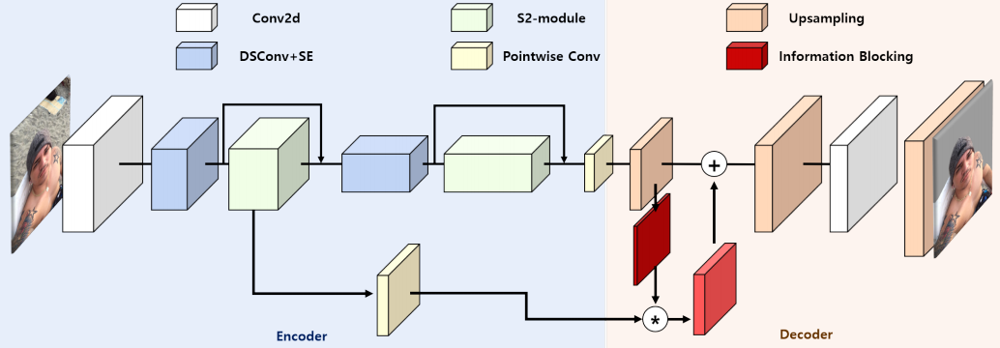
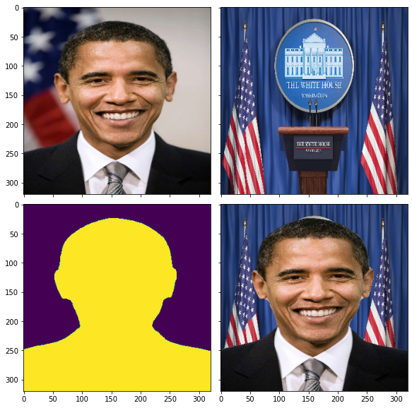

#### SINet: Extreme Lightweight Portrait Segmentation

SINet is an **lightweight** portrait segmentation DNN architecture for mobile devices. The  model which contains around **86.9 K parameters** is able to run at **100 FPS** on iphone (input size -224) , while maintaining the **accuracy** under an 1% margin from the state-of-the-art portrait segmentation method. The proposed portrait segmentation model contains two new modules for fast and accurate segmentation viz. **information blocking decoder structure and spatial squeeze modules**.

1. **Information Blocking Decoder**: It measures the confidence in a low-resolution feature map, and blocks the influence of high-resolution feature maps in
highly confident pixels. This prevents noisy information to ruin already certain areas, and allows the model to focus on regions with high uncertainty.  

2. **Spatial Squeeze Modules**: The S2 module is an efficient multi-path network for feature extraction. Existing multi-path structures deal with the various size of long-range dependencies by managing multiple receptive fields. However, this increases latency in real implementations, due to having unsuitable structure with regard to kernel launching and synchronization. To mitigate this problem, they squeeze the spatial resolution from each feature map by average pooling, and show that this is more effective than adopting multi-receptive fields.

Besides the aforementioned features, the SINet architecture uses **depthwise separable convolution and PReLU activation** in the encoder modules. They also use **Squeeze-and-Excitation** (SE) blocks that adaptively recalibrate channel-wise feature responses by explicitly modeling interdependencies between channels, for improving the model accuracy. For training, they used cross entropy loss with additional **boundary refinement**. In general it is **faster and smaller** than most of the  portrait segmentation models; but in terms of accuracy it falls behind portrait-net model by a small margin. The model seems to be **faster than mobilenet-v3** in iOS; but in android it seems likely to make only a marginal difference(due to optimized tflite swish operator).

We trained the SINet model with **aisegment + baidu portrait** dataset using input size **320** and cross entropy loss function, for 600 epochs and achieved an **mIOU of  97.5%**. The combined dataset consists of around **80K images**(train+val), after data augmentation. The final trained model has a size of **480kB** and **86.91K parameters**. Finally, the PyTorch model was exported to ONNX and CoreML formats for mobile deployment.

In practice the model works well with **simple portrait images**; but for videos with more background regions the model produces **artefacts** on the output during inference. Unfortunately both the original models and aisegment retrained models suffer from this problem, even after achieving 95% mIOU after training. In the worst case scenario, we may need to run a **localizer** over the image and crop out the tightly bound ROI region containing person before running the segmentation model or apply morphological opening/closing over the output binary mask. But this comes with **additional cost** and would nullify the overall advantage of the light weight segmentation model.
